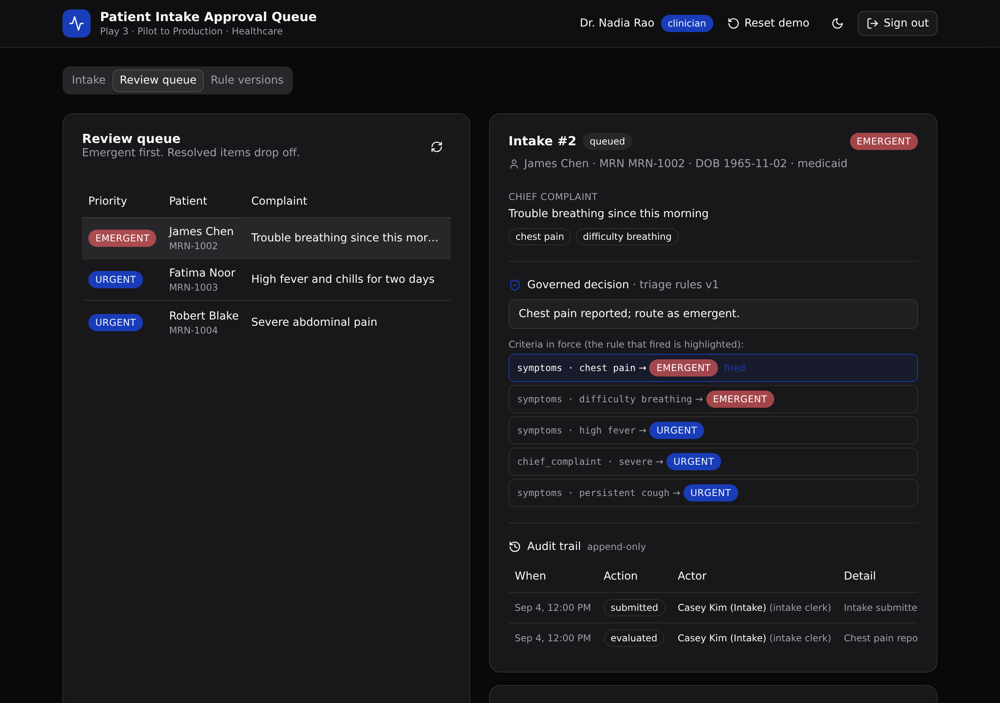

# Patient Intake Approval Queue

A governed backend for a patient intake and clinician review queue. It routes every
intake through a versioned triage rule set, checks the caller's role at the API layer,
and records an append-only audit trail of every action.

`6 tables · 11 API endpoints · 3 RBAC roles · append-only audit trail`



## What it demonstrates

This is the **Pilot to Production** play (Xano's Play 3) for **healthcare**. The frontend
could have shipped in an afternoon from an AI app builder. The point of this project is
everything IT needs before that frontend can touch a real patient: a triage rule set you
can version and audit, role checks that run on the server, and a record of who did what.

Speed is not the argument here. Control is. The business logic lives in one typed API
layer a technical evaluator can read and trust:

- **A versioned triage rule set.** The active rule set decides each intake's priority and
  records the exact version and the reason on the intake. Publishing a new version retires
  the old one, and older intakes keep pointing at the version that actually routed them.
- **API-layer RBAC.** An `auth` table plus a per-endpoint role guard (`s.precondition`).
  A claim, approve, deny, or publish from the wrong role is rejected on the server with a
  403, not hidden behind a disabled button. Auth is enforced at the API layer, never with
  row-level security.
- **An append-only audit trail.** Every state change (submitted, evaluated, claimed,
  approved, denied) writes one row with the actor and the time. Nothing is updated after
  insert, so the history of an intake is always reconstructable.

## Repo layout

```
xano/
  index.ts             the workspace, registering everything
  tables/              users, patients, triage_rules, intakes, review_queue, review_actions
  api/intake.ts        the API group (pinned canonical slug)
  api/*.ts             the 11 endpoints
  lib/guards.ts        requireRole: the shared API-layer role guard
  xano.lock            pinned object identities (committed)
frontend/
  src/lib/api.ts       the one contract: paths and types derived from the query defs
  src/screens/         login, submit, queue, detail, rules
docs/
  index.html           the landing page (served by GitHub Pages)
  screenshot.png       the running app
```

## API surface

All endpoints live under one API group, `intake`.

| Verb | Path | What it enforces |
| --- | --- | --- |
| POST | `/api:intake/auth/login` | Public. Verifies the credential, mints a token, returns the role. |
| POST | `/api:intake/submit` | Intake clerk. Matches or creates a patient by MRN, opens the intake. |
| POST | `/api:intake/evaluate` | Intake clerk. Runs the active rules, stamps priority, version, and reason, queues it. |
| POST | `/api:intake/queue/claim` | Clinician. Claims an open queue item. |
| POST | `/api:intake/queue/approve` | Clinician. Approves a claimed intake. |
| POST | `/api:intake/queue/deny` | Clinician. Denies a claimed intake with a reason. |
| GET | `/api:intake/queue` | Clinician or viewer. The queue, emergent first. |
| GET | `/api:intake/detail/{intake_id}` | Any signed-in user. The intake, its routing rule, and its audit trail. |
| POST | `/api:intake/rules/activate` | Clinician. Publishes a new triage rule version. |
| GET | `/api:intake/rules` | Any signed-in user. Every rule version, active flagged. |
| GET | `/api:intake/seed` | Public. Seeds the demo (idempotent; `?reset=true` wipes and reseeds). |

## Quick start

Go from clone to a live, governed backend in about a minute.

```sh
git clone https://github.com/xano-scratch/patient-intake-approval-queue
cd patient-intake-approval-queue
npm install
npx xanots login        # authenticate with Xano once
npm run xano:deploy      # builds the frontend, deploys backend + static together
```

The deploy prints the live URLs. Open the frontend and it seeds demo data on first load,
so the queue, the detail view, and the rule versions all show real records right away.
Sign in as any seeded user (password `password123`):

- `clerk@clinic.test` (intake clerk) submits and evaluates intakes.
- `clinician@clinic.test` (clinician) claims, approves, denies, and publishes rules.
- `viewer@clinic.test` (viewer) reads the queue and the audit trail.

To see the RBAC in action, sign in as the viewer and try to approve an item. The API
returns a 403, shown inline as blocked by role.

## How the triage decision works

`triage_rules.criteria` is an ordered list of conditions, each shaped
`{ field, value, priority, reason }`. `evaluate` loads the one active version and walks
the list. The first match wins: a symptom rule matches a token in the intake's symptom
list, and a chief-complaint rule matches text in the complaint. The intake records the
priority, the version, and the reason, so the decision is never a black box.

## FAQ

**Is this row-level security?** No. Every permission check runs at the API layer, in the
endpoint stack, against the caller's role. That is Xano's auth model.

**Where is the business logic?** In `xano/`, as typed def objects. The frontend derives
its request paths and response types from those same defs (`frontend/src/lib/api.ts`), so
a schema change surfaces as a type error, not a runtime surprise.

**Can I change the triage rules without redeploying?** Yes. Publish a new version from the
Rule versions screen. The prior version is kept, and past intakes keep the version that
routed them.

**Are the demo links permanent?** No. A deployed preview is an ephemeral environment. Run
`npm run xano:deploy` again for fresh links; the repo is the durable artifact.

## License

MIT.
